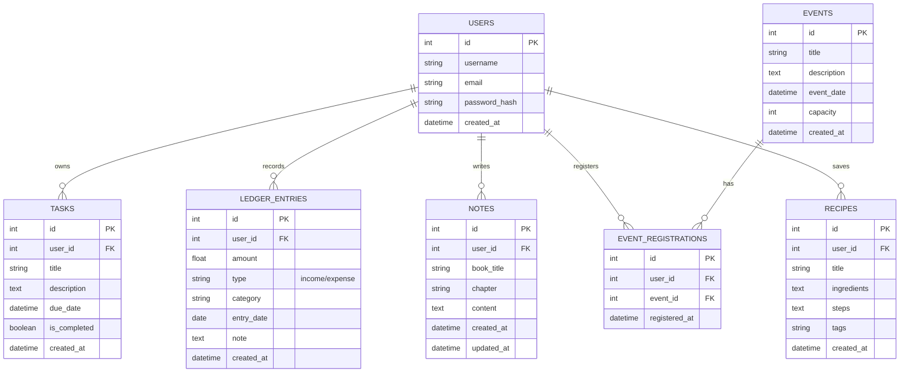

# Database Design (MyLife)

## ER Diagram

## Table Descriptions

### users
Stores user account information.
- `id`: Primary key.
- `username`: Unique username.
- `email`: Unique email address.
- `password_hash`: Salted and hashed password.
- `created_at`: Account creation timestamp.

### tasks
Stores to-do list items.
- `user_id`: Foreign key to users.
- `title`: Task summary.
- `due_date`: Optional deadline.
- `is_completed`: Completion status.

### ledger_entries
Stores financial transactions.
- `type`: Either 'income' or 'expense'.
- `amount`: Monetary value.
- `entry_date`: Date of transaction.

### notes
Stores reading notes.
- `book_title`: Name of the book.
- `chapter`: Chapter or section.
- `content`: The actual note text.

### events
Stores available events for registration.
- `event_date`: When the event takes place.
- `capacity`: Maximum number of participants.

### event_registrations
Join table for user-event enrollment.
- `user_id`: Foreign key to users.
- `event_id`: Foreign key to events.

### recipes
Stores cooking recipes.
- `ingredients`: List of ingredients.
- `steps`: Preparation steps.
- `tags`: Categorization tags (comma-separated or JSON).
