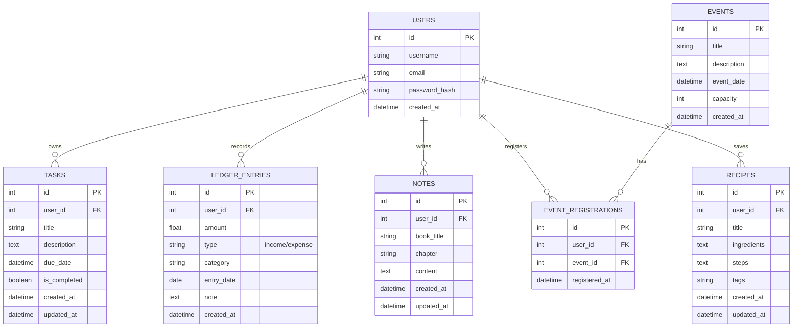

# Database Design (MyLife)

## ER Diagram



## Table Descriptions

### users
Stores user account information.
- `id`: Primary key.
- `username`: Unique username.
- `email`: Unique email address.
- `password_hash`: Salted and hashed password.
- `created_at`: Account creation timestamp.

### tasks
Stores to-do list items.
- `user_id`: Foreign key to users.
- `title`: Task summary (required).
- `description`: Detailed task notes.
- `due_date`: Optional deadline.
- `is_completed`: Completion status (defaults to false).
- `updated_at`: Last modification timestamp.

### ledger_entries
Stores financial transactions (Personal Accounting).
- `user_id`: Foreign key to users.
- `amount`: Monetary value (positive).
- `type`: Either 'income' or 'expense'.
- `category`: Category (e.g., Food, Salary, Rent).
- `entry_date`: Date of transaction.
- `note`: Optional memo.

### notes
Stores reading notes (Reading Notebook).
- `user_id`: Foreign key to users.
- `book_title`: Name of the book (required).
- `chapter`: Chapter or section.
- `content`: The actual note text.
- `updated_at`: Last modification timestamp.

### events
Stores available events for registration.
- `title`: Event name.
- `description`: Event details.
- `event_date`: When the event takes place.
- `capacity`: Maximum number of participants.

### event_registrations
Join table for user-event enrollment.
- `user_id`: Foreign key to users.
- `event_id`: Foreign key to events.
- `registered_at`: When the user signed up.

### recipes
Stores cooking recipes.
- `user_id`: Foreign key to users.
- `title`: Recipe name (required).
- `ingredients`: List of ingredients.
- `steps`: Preparation steps.
- `tags`: Categorization tags (comma-separated string).
- `updated_at`: Last modification timestamp.

## SQL Schema (database/schema.sql)

```sql
-- SQLite Schema for MyLife System

CREATE TABLE IF NOT EXISTS users (
    id INTEGER PRIMARY KEY AUTOINCREMENT,
    username TEXT UNIQUE NOT NULL,
    email TEXT UNIQUE NOT NULL,
    password_hash TEXT NOT NULL,
    created_at DATETIME DEFAULT CURRENT_TIMESTAMP
);

CREATE TABLE IF NOT EXISTS tasks (
    id INTEGER PRIMARY KEY AUTOINCREMENT,
    user_id INTEGER NOT NULL,
    title TEXT NOT NULL,
    description TEXT,
    due_date DATETIME,
    is_completed BOOLEAN NOT NULL DEFAULT 0,
    created_at DATETIME DEFAULT CURRENT_TIMESTAMP,
    updated_at DATETIME DEFAULT CURRENT_TIMESTAMP,
    FOREIGN KEY (user_id) REFERENCES users (id) ON DELETE CASCADE
);

CREATE TABLE IF NOT EXISTS ledger_entries (
    id INTEGER PRIMARY KEY AUTOINCREMENT,
    user_id INTEGER NOT NULL,
    amount REAL NOT NULL,
    type TEXT CHECK(type IN ('income', 'expense')) NOT NULL,
    category TEXT,
    entry_date DATE NOT NULL,
    note TEXT,
    created_at DATETIME DEFAULT CURRENT_TIMESTAMP,
    FOREIGN KEY (user_id) REFERENCES users (id) ON DELETE CASCADE
);

CREATE TABLE IF NOT EXISTS notes (
    id INTEGER PRIMARY KEY AUTOINCREMENT,
    user_id INTEGER NOT NULL,
    book_title TEXT NOT NULL,
    chapter TEXT,
    content TEXT,
    created_at DATETIME DEFAULT CURRENT_TIMESTAMP,
    updated_at DATETIME DEFAULT CURRENT_TIMESTAMP,
    FOREIGN KEY (user_id) REFERENCES users (id) ON DELETE CASCADE
);

CREATE TABLE IF NOT EXISTS events (
    id INTEGER PRIMARY KEY AUTOINCREMENT,
    title TEXT NOT NULL,
    description TEXT,
    event_date DATETIME NOT NULL,
    capacity INTEGER NOT NULL,
    created_at DATETIME DEFAULT CURRENT_TIMESTAMP
);

CREATE TABLE IF NOT EXISTS event_registrations (
    id INTEGER PRIMARY KEY AUTOINCREMENT,
    user_id INTEGER NOT NULL,
    event_id INTEGER NOT NULL,
    registered_at DATETIME DEFAULT CURRENT_TIMESTAMP,
    FOREIGN KEY (user_id) REFERENCES users (id) ON DELETE CASCADE,
    FOREIGN KEY (event_id) REFERENCES events (id) ON DELETE CASCADE,
    UNIQUE(user_id, event_id)
);

CREATE TABLE IF NOT EXISTS recipes (
    id INTEGER PRIMARY KEY AUTOINCREMENT,
    user_id INTEGER NOT NULL,
    title TEXT NOT NULL,
    ingredients TEXT,
    steps TEXT,
    tags TEXT,
    created_at DATETIME DEFAULT CURRENT_TIMESTAMP,
    updated_at DATETIME DEFAULT CURRENT_TIMESTAMP,
    FOREIGN KEY (user_id) REFERENCES users (id) ON DELETE CASCADE
);

CREATE INDEX IF NOT EXISTS idx_tasks_user_id ON tasks(user_id);
CREATE INDEX IF NOT EXISTS idx_ledger_user_id ON ledger_entries(user_id);
CREATE INDEX IF NOT EXISTS idx_notes_user_id ON notes(user_id);
CREATE INDEX IF NOT EXISTS idx_registrations_user_id ON event_registrations(user_id);
CREATE INDEX IF NOT EXISTS idx_recipes_user_id ON recipes(user_id);
```
